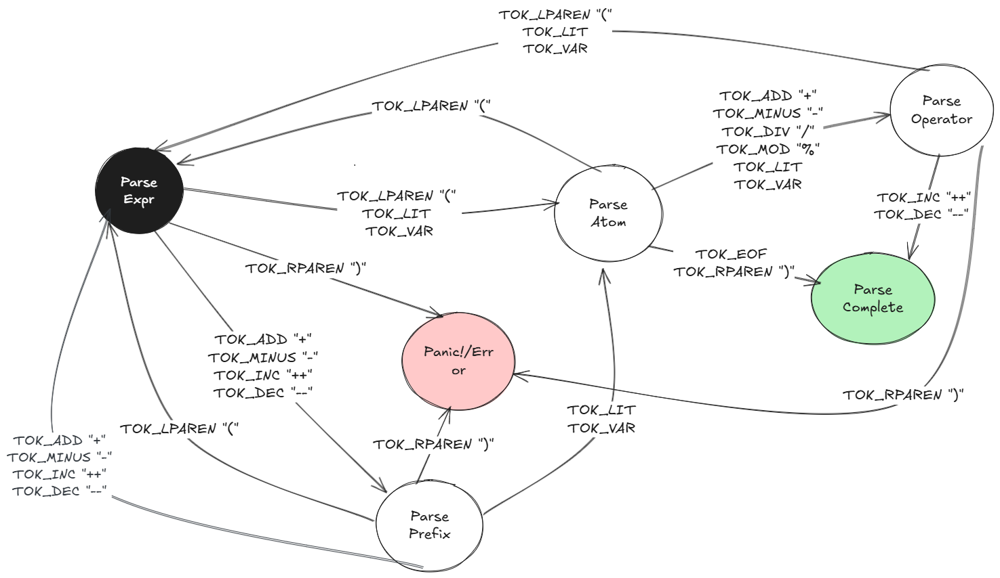

# ExpressionTree
This is an attempt to create a simple scanner (tokenizer) and parser that builds a parse tree from a user specified mathematical expression.

# Lexical Symbols:
The tokenizer recognizes the following as valid symbols: 
- variables (regex `^[A-Za-z_]+[A-Za-z0-9_]$`) 
- integral numeric literals (regex `^[0-9]+$`)
- operators (one of `{'+', '-', '*', '/', '%', '++', '--'}`)

# Grammar:
```
		expr	:=  expr '+' Mult
			|   expr '-' Mult
			|   Mult

		Mult	:= Mult '*' Unary
			|  Mult '/' Unary
			|  Mult '%' Unary
			|  Mult Atom
			|  Unary

		Unary	:= '+' Unary
			|  '-' Unary
			|  IncDec

		IncDec  := '++' IncDec
			|  '--' IncDec
			|  IncDec '++'
			|  IncDec '--'
			|  Atom

		Atom	:= TOK_LIT | TOK_VAR | '(' expr ')'

		TOK_VAR	:= ^[A-Za-z]+[_A-Za-z0-9]*$
		TOK_LIT	:= ^[0-9]+$
```

## Left Recursion Eliminated Grammar
```
			expr 	:= Mult+ (['+'|'-'] Mult)*

			Mult 	:= Unary+ (['*'|'/'|'%'] Unary)* 
				|  Unary+ Atom?

			Unary	:= ['+'|'-']* IncDec+

			IncDec  := ['++'|'--']* Atom+
				|  Atom+ ['++'|'--']*

			Atom	:= TOK_LIT | TOK_VAR | '(' expr ')'

			TOK_LIT	:= ^[0-9]+$
			TOK_VAR	:= ^[A-Za-z]+[_A-Za-z0-9]*$
```

- **Note**: implicit multiplication is supported via the syntax 
``` 
	(TOK_LIT|TOK_VAR) <space> (TOK_LIT|TOK_VAR) 
```
This differs from regular programming language grammar for which above syntax could mean `(TOK_LIT|TOK_VAR)` initialization.

# Output (parseTree.txt)
- The output is a simple visual display of the AST. Specifically, a pre-order tree-walk of the AST.
- An ASTNode is either a `TOK_LIT`, a `TOK_VAR`, or an operator surrounded by `""`.
- A node's child is placed below itself, preceed with a space and the symbol `|__`.
  - notice that 2 children are siblings (on the same level of the entire AST) if their `|__` symbols line up with each other.
  - As an example, the AST for expression `(a + b) / 2` will look like
  ```
	"/"
	 |__"+"
	  |__"a"
	  |__"b"
	 |__"2"
  ```

- Implicit mulitiplication is still under work.
	- Currently, expression `2 a` and `a 2` will be represented as 
	```
	  "a"				"2"	
	   |__"2"   	 		 |__ "a"
	```
	- The former tree rooted at `"a"` has `"2"` as its only child, and the latter is rooted at `"a"`, taking `"2"` as its only child
# Compile/Build Instructions
- If an `ExpressionTree` is built successfully, it will be printed onto a file named `parseTree.txt` in this directory.

Assume `gcc` and `Make` are available on the machine.

- refer to `Makefile` for build, test, and clean instructions.
- On successful builds, an executable named `expressionTree` will be present in the working directory.
- if `valgrind` is installed on the machine, `make valgrind` will run the executable with valgrind to check for memory errors.

# Design Notes (basically a TODO/TOFIX/TOIMPROVE section for me)
## Parser State Machine

This is a depiction of how an expression would be parsed using a state machine
- start state is `parse_expr`.
- possible end states are `Panic!/Error` and `Parse Complete`

## Rules Summary

### Simple Build

```
	make
```

### Build Then Execute

```
	make test
```

### Build, Test, Execute, then Check Memory Fault

- assume `valgrind` is installed on machine

```	
	make valgrind
```

### Remove Executable

```
	make clean
```
# Inspirations and References
1. https://github.com/PixelRifts/math-expr-evaluator/tree/master
2. https://craftinginterpreters.com
3. https://matklad.github.io/2020/04/13/simple-but-powerful-pratt-parsing.html


