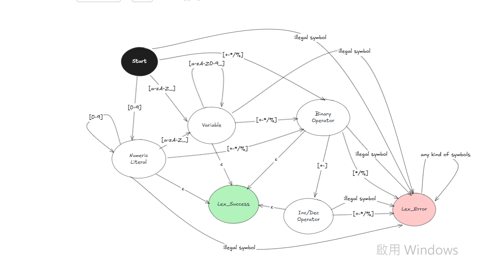
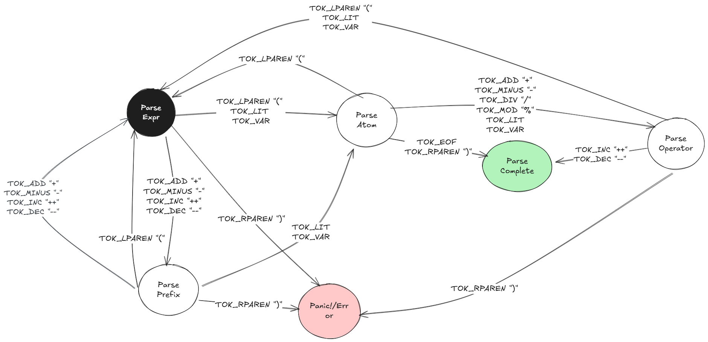

# Design Notes
## Lexer State Machine

Above depicted the (ideal) lexing process with a state machine
- Start state is `Start`
- An empty string (symbol) is denoted with the greek letter `ε`
- Possible end states are `Lex_Success` and `Lex_Error`

## Parser State Machine

Above is a depiction of how an expression would be parsed using a state machine
- start state is `parse_expr`.
- possible end states are `Panic!/Error` and `Parse Complete`
